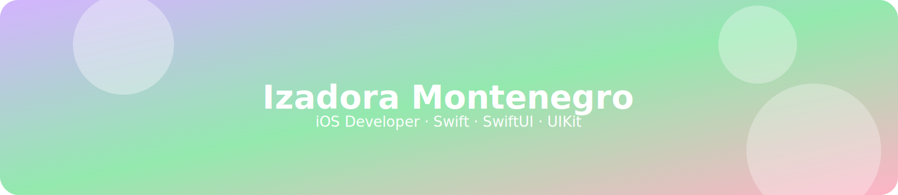

  

---

# 🌿 Izadora Montenegro

  
  
  
  
  
  
  
  
  

🍎 Student at Apple Developer Academy — Fortaleza  
🎓 Engenharia da Computação — IFCE Fortaleza  
📱 iOS Mobile Developer (Swift, SwiftUI, UIKit)  
🎨 Mobile UI/UX Designer

Atualmente estou focada em desenvolvimento iOS, trabalhando com **SwiftUI, UIKit, SwiftData e CoreData**, além de ter experiência com **UI/UX para apps móveis**.  
Gosto de construir interfaces claras, fluxos diretos e experiências que façam sentido de verdade para quem está usando.

  

<!--

  

-->

---

## 🌸 Onde me encontrar

  
  
  

